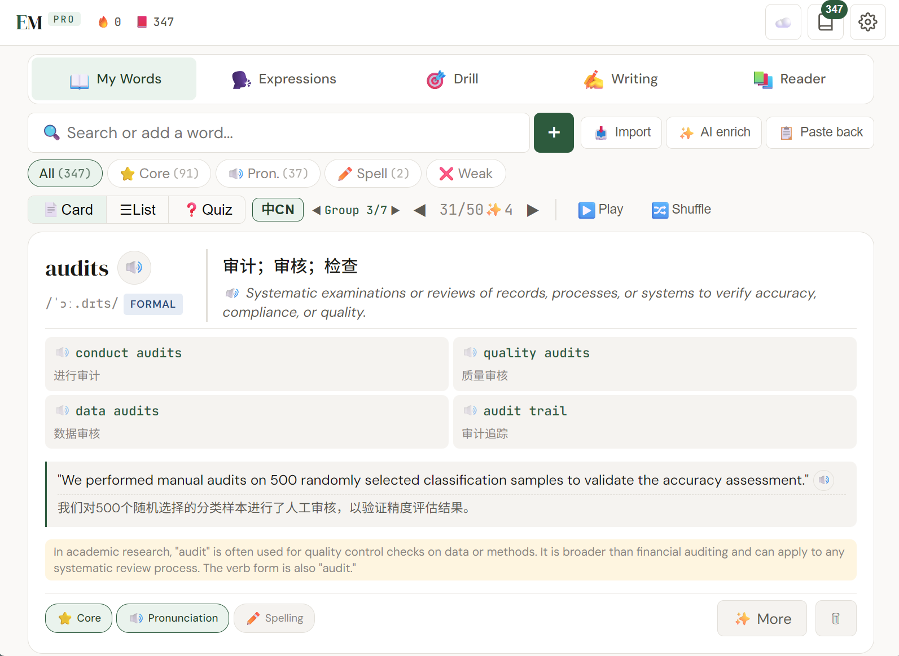

# VocabPeak · 高考英语词汇

给中国高中生用的英语单词学习 PWA。围绕真实的记忆规律构建：内置高中词库开箱即用、间隔重复（SRS）安排复习、选择题测验自动标记薄弱词、AI 批量补全音标释义搭配例句、巩固短文把本组的词放回语境里做选词填空。全程离线可用，家长可通过独立后台远程查看学习记录。

由 [EMPro](https://jack-ee.github.io/EMPro/)（面向科研人员的英语工作台）fork 而来，与 EMPro 部署在同一 GitHub Pages 源下。两者通过严格的命名前缀隔离，互不干扰（详见下文"与 EMPro 的同源隔离"）。

<!-- TODO: 换成 VocabPeak 自己的截图 -->

- 应用地址：https://jack-ee.github.io/VocabPeak/
- 家长后台：https://jack-ee.github.io/VocabPeak/dashboard.html

## 项目状态

活跃的个人项目。核心链路（单词页 → SRS 复习 → 测验 → 巩固短文 → 云同步 → 家长后台）已系统性排查并配有回归测试。"训练"和"阅读"页可用但打磨较少。Expressions、Writing Lab、口语教练等 EMPro 遗留模块已用 `display:none` 隐藏，代码保留但不参与本应用的功能面。

## 功能

### 单词（主页面）

- 三种视图：卡片、列表、测验（中文四选一）。中文释义默认隐藏，点"中文"按钮或按空格显示
- 分组学习：默认 50 词一组，组大小可在设置里调；进度按筛选分别记忆
- SRS 复习："复习"筛选列出到期词，四档评分（忘记 / 困难 / 良好 / 容易），间隔 1、3、7、14、30、60 天，容易翻倍
- 焦点标记：核心 / 发音 / 拼写手动标记；测验答错自动标"薄弱"，连对 3 次自动摘除
- 自动播放：按 词 → 英文释义 → 中文释义 → 搭配 → 例句 顺序朗读整组，播放期间屏幕常亮，各环节可在设置里单独开关
- 打乱：仅视图层洗牌，不改存储顺序，种子固定保证翻页连贯

### 内置词库与导入

- 内置高中词库（核心 + 拓展），首次运行自动载入核心词。守卫条件：未载入过、生词本为空、本机未配置云同步，三者同时满足才载入，绝不覆盖已有数据
- 粘贴导入：支持一行一词、`词 | 释义 | 搭配`、逗号分隔等多种格式，命中离线词典的词自动带中文释义
- 批量 AI 补全：一键复制本组待补全词的提示词 → 到 Claude.ai 粘贴 → 把回复回填。回填按 INPUT 字段精确匹配原词行，词形变化（squeezed → squeeze）自动归并到词元，已有中文释义和 SRS 复习进度原样保留

### 巩固短文（选词填空）

针对当前分组生成 2-3 篇短文，目标词挖空为四选一。同样走"复制提示词 → AI → 回填"流程，解析对缺 TITLE、多余空行、格式异常的空等情况均有容错。短文按（筛选, 组号）存储并随云同步。

### 训练与阅读

- 训练：同义词辨析、搭配选择的即时刷题（内置题库，无需 API），以及 AI 生成的进阶题
- 阅读：粘贴文章提取生词，按级别和类型筛选后一键存入生词本

### 家长后台（dashboard.html）

独立页面，用同一 GitHub 令牌只读拉取孩子的同步 Gist，不改动任何数据。展示连续学习天数、今日与近 7 天的新词/复习/测验量、词汇掌握分布、18 周学习热力图、逐日明细和薄弱词清单。家长浏览器只存自己的 `vpdash_` 前缀设置，不触碰应用数据。

## 数据与同步模型

所有学习数据存在浏览器 localStorage（键前缀 `hsv_kid_`），无后端、无遥测、无账号。

云同步为可选项，基于 GitHub Gist：

- 整份快照、后写覆盖。加载、聚焦、可见性变化和每 30 秒轮询时拉取，数据变更后 3 秒防抖推送
- 同步文件名 `hsv-sync-kid.json`，档案 ID 在 config.js 写死为 `kid`，换设备、清缓存、重装都指向同一份数据
- 按天日志用独立键 `day_YYYY-MM-DD`，两设备在不同日期学习互不覆盖；拉取合并对 day 键"只增不删"，离线几天的记录不会被其它设备的快照抹掉，恢复联网后自动把并集补推上云。同一天两台设备各自离线学习仍是后写覆盖（同键 LWW）
- 纯本机偏好（草稿、组内位置、打乱状态）在同步黑名单里，不会把另一台设备的视图状态拽来拽去
- 新设备首次配置令牌时先搜索已有 Gist 并拉取，找不到才新建，空设备不会覆盖云端数据

密钥策略：GitHub 令牌只需 `gist` 权限，仅存本机、永不入同步包。AI API key 默认不同步，需在设置里明确开启后才随 Gist 传播。OpenAI TTS key 无论如何都不进同步包。

## 离线与语音

安装为 PWA 后完全离线可用：Service Worker 预缓存全部本地资源（网络优先、离线回退），词典和词库随应用打包。Google 字体跨域不缓存，离线时回落系统字体。

发音走三级回退：

1. 离线发音包：预生成的单词音频（GitHub Release 资产，经 Cloudflare Worker 中转下载），存在独立的 IndexedDB 库里永不淘汰，命中即播、零网络零密钥，每次随机换音色
2. 神经语音：OpenAI gpt-4o-mini-tts，经同一个 Cloudflare Worker 代理（浏览器无法直连 OpenAI），合成结果双层缓存（内存 + IndexedDB），每段文本每设备最多请求一次
3. 设备自带语音：最终兜底；中文文本始终走设备中文音色

发音包由 GitHub Actions 构建（`tools/generate_audio_pack.py` + `.github/workflows/audio-pack.yml`）：在设置里选音色、导出 wordlist.txt、替换 `tools/wordlist.txt` 并提交即触发增量构建，OpenAI 密钥只存在仓库的 Action Secret 里。

## 快速开始

孩子的设备：

1. 打开 https://jack-ee.github.io/VocabPeak/ ，首次运行自动载入内置核心词，即可开始学习
2. 建议安装为 PWA（Chrome 菜单 → 安装应用），获得离线能力和独立图标
3. 云同步：在 https://github.com/settings/tokens 创建仅 `gist` 权限的令牌，粘贴到 设置 → Sync
4. 语音增强（可选）：部署 `vocabpeak-tts-proxy.js` 到 Cloudflare Worker，把 Worker 地址填入 设置 → Voice，即可使用神经语音和下载离线发音包

家长：

打开 dashboard.html，粘贴同一个 GitHub 令牌、档案 ID 填 `kid`，连接后即可查看。

网络提示：中国大陆访问 GitHub（同步、发音包）和 OpenAI（神经语音）需要科学上网；应用本体安装后离线可用，不受影响。

## 与 EMPro 的同源隔离

两个应用同源部署（jack-ee.github.io），localStorage、IndexedDB、Cache Storage 均按源共享、不按路径隔离，因此所有存储命名必须分家。本项目的约定：

| 存储 | EMPro | VocabPeak |
| --- | --- | --- |
| localStorage 前缀 | emp_ | hsv_ |
| 同步 Gist 文件名 | emp-sync-*.json | hsv-sync-kid.json |
| TTS 缓存库（IndexedDB） | emp-tts | hsv-tts |
| 发音包库（IndexedDB） | emp-tts-pack | hsv-tts-pack |
| SW 缓存名 | emp-vN | hsv-vN |
| 页面事件 | emp:datachanged | hsv:datachanged |

维护红线：任何代码不得读写无前缀裸键或 emp_ 键。回归测试对全部运行时文件做裸键扫描。

## 部署与缓存纪律

改动任何被缓存的运行时文件（index.html 引用的 JS/CSS）时，必须同时：

1. bump sw.js 的 `CACHE_NAME`（hsv-vN → hsv-vN+1）
2. 全文替换 index.html 里所有 `?v=N` 为 N+1

两者漏改任何一个都会造成"改了不生效 / 半新半旧"的诡异问题。README、dashboard.html、sync-test.html、tools/ 不在预缓存清单内，单独改动它们无需 bump。

## 目录结构

| 文件 | 职责 |
| --- | --- |
| index.html | 应用外壳与全部 UI，带 ?v=N 缓存击穿 |
| config.js | PROFILE_ID、STORAGE_PREFIX 等单一配置源 |
| db.js | 数据层：生词本、SRS、统计、按天日志 |
| sync.js | Gist 云同步 |
| my-words.js | 单词页主模块 |
| cloze.js | 巩固短文 |
| vocab-drill.js / reader.js | 训练页 / 阅读页 |
| dictionary.js / vocab-hs-data.js | 离线词典 / 内置高中词库 |
| app.js | 启动、设置、TTS、弹窗、公共工具 |
| tts-pack.js | 离线发音包加载与播放 |
| sw.js | Service Worker（预缓存 + 网络优先） |
| dashboard.html | 家长后台（独立、只读） |
| sync-test.html | 同步诊断工具页（绕过 SW，逐步排查） |
| debug-panel.js | 调试面板（设置 → Developer 开启） |
| vocabpeak-tts-proxy.js | Cloudflare Worker 源码 |
| tools/ | 发音包构建脚本与词表 |

## 隐私

学习数据只在孩子的设备和其本人 GitHub 账号的私有 Gist 之间流动，作者不经手任何数据。AI 功能使用你自己的 API key（Claude / OpenAI / DeepSeek / Gemini / 豆包），费用计入你自己的账户。

## 许可

个人项目，供自家使用；无附带许可证，如需复用请先联系作者。
